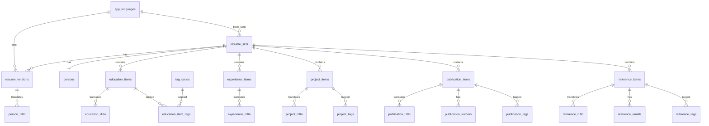

# Schema v2 - ERD-Driven Database Schema

This document describes the v2 database schema for CV Generator, which implements a fully normalized i18n-first design based on the ERD specification.

## Overview

The v2 schema provides:

- **Multi-language support**: All translatable content lives in `*_i18n` tables
- **Stable identifiers**: The `resume_key` field maps to `config.ID` from JSON files
- **Language variants**: Each person can have multiple language versions (en, de, fa, etc.)
- **Tag system**: Full i18n support for tags with the original tag codes preserved

## Key Concepts

### Resume Sets

A `resume_set` represents a single person across all languages. It's keyed by `resume_key` which matches the `config.ID` field in CV JSON files.

```sql
-- One entry per person
resume_sets(resume_key, base_lang_code, created_at, updated_at)
```

### Resume Versions

A `resume_version` represents one language variant of a resume. The combination of `(resume_key, lang_code)` is unique.

```sql
-- One entry per person × language
resume_versions(id, resume_key, lang_code, is_base, is_published, ...)
```

### i18n Tables

All translatable content is stored in separate `*_i18n` tables, each referencing:
- The parent entity (e.g., `person_id`, `education_item_id`)
- The `resume_version_id` for language context

```sql
-- Example: person_i18n stores translated names and summaries
person_i18n(id, person_id, resume_version_id, fname, lname, summary)
```

## ERD Diagram



## Table Reference

### Core Infrastructure

| Table | Purpose |
|-------|---------|
| `app_languages` | Supported languages (en, de, fa) with direction |
| `resume_sets` | Groups all language variants for one person |
| `resume_versions` | One record per (resume_key × lang_code) |
| `meta` | Schema version tracking |

### Person/Basics

| Table | Purpose |
|-------|---------|
| `persons` | Invariant person data (email, birth_date, phone) |
| `person_i18n` | Translated names and summaries |
| `person_locations` | Location entries with postal codes |
| `person_location_i18n` | Translated address components |
| `person_pictures` | Profile and cover photos |
| `person_labels` | Career labels/titles |
| `person_label_i18n` | Translated labels |

### Profiles

| Table | Purpose |
|-------|---------|
| `profile_accounts` | Social media/professional links |
| `profile_account_i18n` | Translated network names |

### Education

| Table | Purpose |
|-------|---------|
| `education_items` | Education entries with dates/GPA |
| `education_i18n` | Translated institution names, areas |
| `education_item_tags` | Tag assignments |

### Spoken Languages

| Table | Purpose |
|-------|---------|
| `spoken_language_items` | Language proficiencies |
| `spoken_language_i18n` | Translated language names |
| `spoken_language_certs` | Language certifications |
| `spoken_language_cert_i18n` | Translated cert info |

### Certifications

| Table | Purpose |
|-------|---------|
| `cert_issuers` | Certificate issuing organizations |
| `cert_issuer_i18n` | Translated issuer names |
| `certifications` | Individual certificates |
| `certification_i18n` | Translated cert names |
| `certification_tags` | Tag assignments |

### Skills

| Table | Purpose |
|-------|---------|
| `skill_categories` | Top-level skill categories |
| `skill_category_i18n` | Translated category names |
| `skill_subcategories` | Subcategories within categories |
| `skill_subcategory_i18n` | Translated subcategory names |
| `skill_items` | Individual skills |
| `skill_item_i18n` | Translated skill names |
| `skill_item_tags` | Tag assignments |

### Experiences

| Table | Purpose |
|-------|---------|
| `experience_items` | Work experience entries |
| `experience_i18n` | Translated roles, descriptions |

### Projects

| Table | Purpose |
|-------|---------|
| `project_items` | Project entries with URLs |
| `project_i18n` | Translated titles, descriptions |
| `project_tags` | Tag assignments |

### Publications

| Table | Purpose |
|-------|---------|
| `publication_items` | Publication metadata (DOI, dates) |
| `publication_i18n` | Translated titles, journal names |
| `publication_authors` | Author list per language |
| `publication_editors` | Editor list per language |
| `publication_supervisors` | Supervisor list per language |
| `publication_tags` | Tag assignments |

### References

| Table | Purpose |
|-------|---------|
| `reference_items` | Reference contacts |
| `reference_i18n` | Translated positions, institutions |
| `reference_emails` | Email addresses |
| `reference_tags` | Tag assignments |

### Tags

| Table | Purpose |
|-------|---------|
| `tag_codes` | Stable tag identifiers |
| `tag_i18n` | Translated tag labels |

## Migration from v1

### Automatic Migration

The migration script handles the transformation from v1 to v2:

```python
from cv_generator.migrations.migrate_to_v2 import migrate_to_v2

# Migrate with backup
results = migrate_to_v2(db_path, backup=True)

if results["success"]:
    print(f"Migrated {results['records_migrated']['persons']} persons")
```

### Migration Mapping

| v1 Table | v2 Tables |
|----------|-----------|
| `person` | `resume_sets` + `persons` + `person_i18n` |
| `entry (basics)` | `persons` + `person_i18n` + `person_locations` + etc. |
| `entry (education)` | `education_items` + `education_i18n` |
| `entry (projects)` | `project_items` + `project_i18n` |
| `entry (publications)` | `publication_items` + `publication_i18n` + `publication_authors` |
| `entry (references)` | `reference_items` + `reference_i18n` + `reference_emails` |
| `entry (experiences)` | `experience_items` + `experience_i18n` |
| `entry (languages)` | `spoken_language_items` + `spoken_language_i18n` |
| `entry (skills)` | `skill_categories` + `skill_subcategories` + `skill_items` + i18n |
| `entry (workshop_and_certifications)` | `cert_issuers` + `certifications` + i18n |
| `tag` | `tag_codes` |
| `entry_tag` | `*_tags` junction tables |

### Person Slug Parsing

The v1 `person.slug` is parsed to determine:
- `resume_key`: The base identifier (e.g., "ramin" from "ramin_de")
- `lang_code`: The language suffix (e.g., "de" from "ramin_de", "en" if no suffix)

### Rollback Instructions

If migration fails, restore from the backup created before migration:

```bash
# Backups are named: cv.backup_v1_YYYYMMDD_HHMMSS.db
cp data/db/cv.backup_v1_20240101_120000.db data/db/cv.db
```

## Schema Validation

Verify the schema after migration:

```python
from cv_generator.schema_validator import validate_schema

results = validate_schema(db_path)

if results["valid"]:
    print("Schema is valid")
else:
    for issue in results["issues"]:
        print(f"Issue: {issue}")
```

## Usage Examples

### Creating a New Resume

```python
import sqlite3
from datetime import datetime

conn = sqlite3.connect("data/db/cv.db")
conn.execute("PRAGMA foreign_keys = ON")
cursor = conn.cursor()

# 1. Create resume_set
cursor.execute("""
    INSERT INTO resume_sets (resume_key, base_lang_code, created_at, updated_at)
    VALUES (?, ?, ?, ?)
""", ("john_doe", "en", datetime.now(), datetime.now()))

# 2. Create resume_version
cursor.execute("""
    INSERT INTO resume_versions (resume_key, lang_code, is_base, is_published, created_at, updated_at)
    VALUES (?, ?, 1, 0, ?, ?)
""", ("john_doe", "en", datetime.now(), datetime.now()))
version_id = cursor.lastrowid

# 3. Create person
cursor.execute("""
    INSERT INTO persons (resume_key, email, created_at, updated_at)
    VALUES (?, ?, ?, ?)
""", ("john_doe", "john@example.com", datetime.now(), datetime.now()))
person_id = cursor.lastrowid

# 4. Add i18n data
cursor.execute("""
    INSERT INTO person_i18n (person_id, resume_version_id, fname, lname, summary)
    VALUES (?, ?, ?, ?, ?)
""", (person_id, version_id, "John", "Doe", "Software engineer with 10 years experience"))

conn.commit()
```

### Adding a German Translation

```python
# Create German version
cursor.execute("""
    INSERT INTO resume_versions (resume_key, lang_code, is_base, is_published, created_at, updated_at)
    VALUES (?, ?, 0, 0, ?, ?)
""", ("john_doe", "de", datetime.now(), datetime.now()))
de_version_id = cursor.lastrowid

# Add German i18n
cursor.execute("""
    INSERT INTO person_i18n (person_id, resume_version_id, fname, lname, summary)
    VALUES (?, ?, ?, ?, ?)
""", (person_id, de_version_id, "John", "Doe", "Softwareentwickler mit 10 Jahren Erfahrung"))

conn.commit()
```

### Querying Multi-Language Data

```python
# Get all person info for a resume_key in English
cursor.execute("""
    SELECT p.email, pi.fname, pi.lname, pi.summary
    FROM persons p
    JOIN person_i18n pi ON p.id = pi.person_id
    JOIN resume_versions rv ON pi.resume_version_id = rv.id
    WHERE p.resume_key = ? AND rv.lang_code = ?
""", ("john_doe", "en"))

row = cursor.fetchone()
print(f"{row[1]} {row[2]} - {row[3]}")
```

## Troubleshooting

### "no such table: resume_sets"

The v2 schema hasn't been created. Run:

```python
from cv_generator.schema_v2 import init_db_v2
init_db_v2(db_path)
```

### "FOREIGN KEY constraint failed"

You're trying to insert a record that references a non-existent parent. Ensure:
1. `resume_sets` exists before `resume_versions`
2. `resume_versions` exists before `person_i18n`
3. `app_languages` has the language code you're using

### "UNIQUE constraint failed"

You're trying to create a duplicate entry. Check:
- `resume_versions`: Only one entry per (resume_key, lang_code)
- `person_i18n`: Only one entry per (person_id, resume_version_id)

### Migration Hangs

For large datasets, increase the busy timeout:

```python
conn = sqlite3.connect(db_path)
conn.execute("PRAGMA busy_timeout = 30000")  # 30 seconds
```
